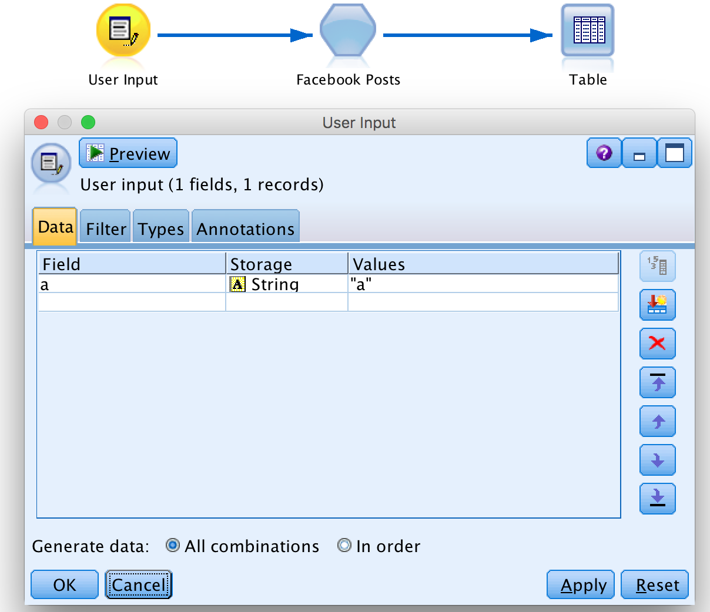

### 'Facebook Posts' Node for IBM SPSS Modeler – Step by Step Tutorial

_Import Facebook posts from a public page directly in SPPS Modeler with this easy-to-use node._

#### Description:
This SPSS Modeler ‘source’ node allows you to import Facebook posts from a page easily. Simply install the node, paste your authentication key and choose the page and number of posts you would like to import. Afterwards you can start doing text analysis on social data and get insights for your business.

#### Requirements:
* R v2.15.2 (does not matter on Mac OS)
* SPSS Modeler v16.0 or later
* SPSS Modeler ‘R essentials’ plugin

### Installation:
In SPSS Modeler Click on '**Extensions**' --> '**Install Local Extenstions Bundle...**' and navigate to the \*.mpe file in this folder.  
**_or..._**  
In SPSS Modeler Click on '**Extensions**' --> '**Extensions Hub...**', search, '**Facebook Posts**' and click '**Install...**'.

---

You can start with the stream '**FacebookPosts_ExampleStream.str**' provided in this folder.

1. In SPSS Modeler v18.0 it is not possible to create proper ‘source’ nodes with R code. However it is made possible if you trick the software a bit: you just have to put a user input with fake fields before the Facebook node in order to start the stream. In this example we put a user input with: Field a ; Storage String ; Values “a” (see the screenshot below).

  

2. asdf
