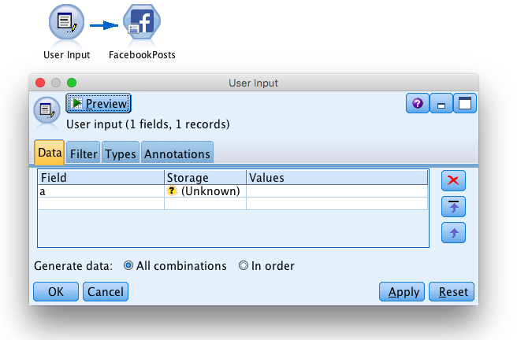
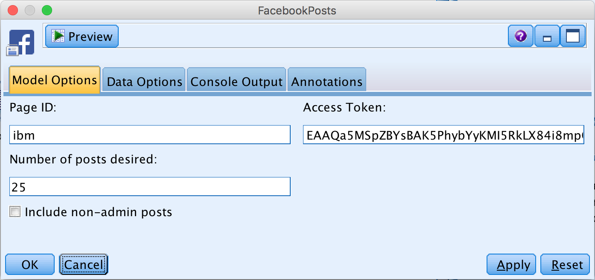
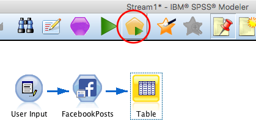
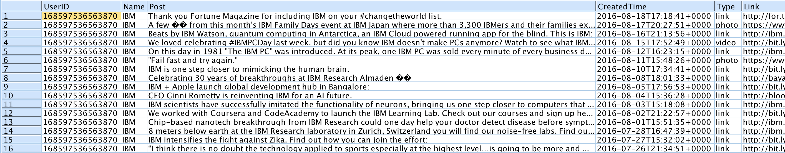

### 'Facebook Posts' Node for IBM SPSS Modeler – Step by Step Tutorial

_Import Facebook posts from a public page directly in SPPS Modeler with this easy-to-use node._

  

#### Description:
This SPSS Modeler ‘source’ node allows you to import Facebook posts from a page easily. Simply install the node, paste your authentication key and choose the page and number of posts you would like to import. Afterwards you can start doing text analysis on social data and get insights for your business.

---

You can start with the stream ['**FacebookPosts_ExampleStream.str**'](../ExampleStream.str) provided in this repository.

###### 1\.  
In SPSS Modeler v18.0 it is not possible to create proper ‘source’ nodes with R code. However it is made possible if you trick the software a bit: you just have to put a user input with fake fields before the Facebook node in order to start the stream. In this example we use a user input with: Field a (see the screenshot below).

  

###### 2\.  
Double click on the ‘Facebook Posts’ node.

  

Now fill the fields:
* ‘Page ID’. You can find the Page ID on the URL of the page you would like to get posts from. http://facebook.com/This_is_the_Page_ID
* ‘Number of posts desired’. The number you specify is the maximum number of posts returned.
* Check or uncheck ‘Include non-admin posts’. You can choose to load only the posts published by the owner of the page or to include the posts published on the page by average users.
* ‘Access Token’. To access data from Facebook you need to have an authentication key that enables you the access via the API. Follow the [‘tutorial’](https://github.com/jonnyenglish/SPSSFacebook#how-to-get-a-facebook-access-token--step-by-step-tutorial).

###### 3\.
Add an output node after the ‘Facebook Posts’ node, in order to visualize the data you gathered. For example you can start with a ‘Table’.
Click on the table and run the stream.  

  

Here is what we obtain:

  

###### 4\.
Now, it’s your turn to gather social data directly into SPSS and start text mining customer opinions. [This](http://www.brianmcnay.com/text-mining/text-mining-tutorial-using-spss-modeler.html) is a good Tutorial to get started.
