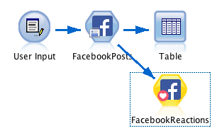
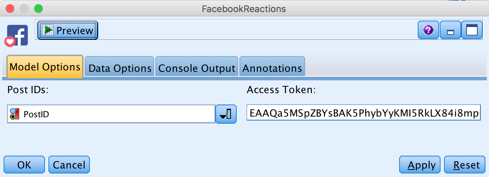
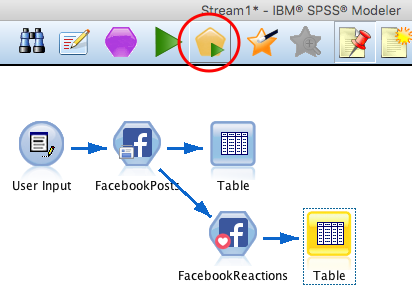

### 'Facebook Reactions' Node for IBM SPSS Modeler – Step by Step Tutorial

_Import Facebook Reactions of a public post from a page directly in SPPS Modeler with this easy-to-use node._

  

#### Description:
This SPSS Modeler process node allows you to import Facebook reactions of a public post from a page easily. Simply install the node, paste your authentication key and select a column that contains Post IDs you would like to import. To get Post IDs you can just use the ['Facebook Posts' node](../Facebook Posts). Afterwards you can start doing customer satisfaction analysis on social data and get insights for your business.

---

You can start with the stream ['**FacebookPosts_ExampleStream.str**'](../ExampleStream.str) provided in this repository.

###### 1\.  
In order to get a list of Facebook Post IDs I suggest to use the ['Facebook Posts' node](../Facebook Posts). Follow ['these steps](../Facebook Posts/README.md) first.

###### 2\.  
When the ‘Facebook Posts’ node is properly working, add the 'Facebook Reactions' node downstream.

  

###### 3\.  
Double click on the ‘Facebook Reactions’ node.

  

Now fill the fields:
* ‘Post IDs’. Select the column with the Post IDs that you got from the ['Facebook Posts' node](../Facebook Posts).
* ‘Access Token’. To access data from Facebook you need to have an authentication key that enables you the access via the API. Follow the [‘tutorial’](https://github.com/jonnyenglish/SPSSFacebook#how-to-get-a-facebook-access-token--step-by-step-tutorial).

###### 4\.
Add an output node after the ‘Facebook Posts’ node, in order to visualize the data you gathered. For example you can start with a ‘Table’.
Click on the table and run the stream.  

  

The 'Facebook Reactions' node adds columns for the different Reactions right behind the output table of the 'Facebook Posts' node. So what we get is a combined table of all Facebook post information and the correspondent reactions. Here is what we obtain:

  

###### 4\.
Now, it’s your turn to gather social data directly into SPSS and start customer satisfaction analysis.
