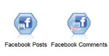
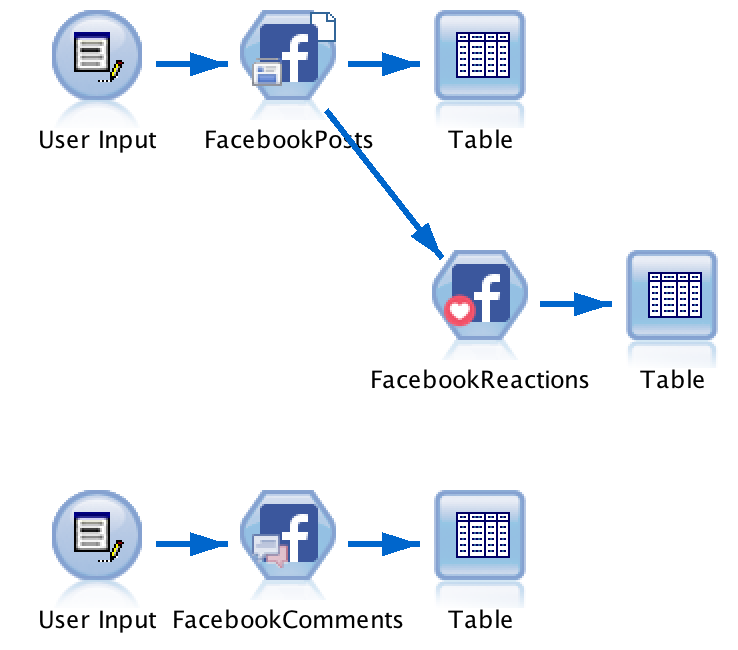

### Discover a Whole New Palette of SPSS Modeler Facebook Nodes
<p align="center">
  
</p>

* **Facebook Posts**: Import Facebook posts from a public page
* **Facebook Comments**: Import Facebook comments from a public post.
* **Facebook Reactions**: Import Facebook reactions to a list of public post.

---

### Quickstart

1. You need a Facebook access token for all request. If you don't have one already, read [this tutorial](#how-to-get-a-facebook-access-token--step-by-step-tutorial).

2. Download and install the [Facebook.mpe file](Facebook.mpe) in SPSS Modeler or search for 'Facebook' in the Predictive Extensions Hub (klick [here](#installation) for detailed instructions).

3. Download the [example stream](ExampleStream.str) to get started.
<p align="center">
  
</p>

### How to Get a Facebook Access Token – Step by Step Tutorial

_The access token enables you to obtain social data from Facebook by using the Facebook nodes._

There is a [whole world](https://developers.facebook.com/docs/facebook-login/access-tokens/) to Facebook access tokens. This tutorial describes how you get a 2 hour (short-lived), 2 months (long-lived) or permanent access token, depending on what you need to obtain data with the SPSS Modeler Nodes. Each of them will work for its lifetime, so just stop at the respective step of the tutorial. Unfortunately you always need the precedent steps. So for the permanent token you need the long-lived and for this one again you need the short-lived. So in either case you need to start with step 1.

1. Go to https://developers.facebook.com/apps/

2. Log in with your Facebook credentials.  
Facebook will ask you first to register as a developer if you haven't already done it.

3. If you don't have one already, click the '**Add a New App**' button

4. Enter a display name, a contact e-mail, choose a category (e.g. '**Business**') and then click on '**Create App ID**'

5. For now we don't need the product setup, so just click on '**Dashboard**' in the navigation pane on the right. Here you find your _App ID_ and your _App Secret_. Leave this tab open in your browser or save the information for later.

6. Go to https://developers.facebook.com/tools/explorer/

7. In the drop-down of '**Application**' select your just created App. In the drop-down of '**Get Token**' select  '**Get User Access Token**'.

8. In the following pane you can select everything and click '**Get Access Token**'. The Facebook login dialogue pops up. If you accept you will find the access token in the respective field of the Graph API Explorer. Leave this tab open in your browser or save the information for later.  
If you click the blue '**i**' right left to the token and then on '**Open in Access Token Tool**', you will see that this token expires in 1 - 2 hours.

  **Congrats you just received your short-lived access token.**  
With this token you could start now working with the SPSS Modeler nodes or you could continue to get tokens that are longer valid.

9. Go to this URL with your browser after replacing the fields with the App ID and App Secret from step 5 and your short-lived token from step 8:  
    ````
    https://graph.facebook.com/oauth/access_token
    ?client_id=YOUR_APP_ID
    &client_secret=YOUR_APP_SECRET
    &grant_type=fb_exchange_token
    &fb_exchange_token=YOUR_SHORT_LIVED_ACCESS_TOKEN
    ````

10. The response will be in the schema of `access_token=YOUR_LONG_LIVED_ACCESS_TOKEN&expires=5184000`  
When you copy your long-lived token make sure to exclude the `access_token=` and the `expires=` and only copy the part in between.

  **Congrats you just received your long-lived access token.**  
If you paste this long-lived token to the [Access Token Tool](https://developers.facebook.com/tools/debug/accesstoken/) you will find an expiration date in about two months. You are one step away to translate this token into a permanently valid one.

11. Go back to the [Graph API Explorer](https://developers.facebook.com/tools/explorer/) and paste your long-lived access token in the access token field. This was enough to convert your long-lived access token into a permanent access token. Double check with the blue '**i**' and '**Open in Access Token Tool**' again. In the field of _Expires_ it now should say '**Never**'.

  **Congrats you long-lived access token is now permanently valid. With this token you now can start using the SPSS Modeler nodes forever** (Or as long as Facebook doesn't change the guidelines.)

### Requirements
* R version that suits your SPSS Modeler version (Min. v2.15.2; does not matter on Mac OS)
* SPSS Modeler v18.0 or later
* SPSS Modeler ‘R essentials’ plugin

### Installation
In SPSS Modeler Click on '**Extensions**' --> '**Install Local Extenstions Bundle...**' and navigate to the [FacebookPosts.mpe](FacebookPosts.mpe) file in this folder.  
**_or..._**  
In SPSS Modeler Click on '**Extensions**' --> '**Extensions Hub...**', search, '**Facebook Posts**' and click '**Install...**'.

### R packages used
RFacebook: http://cran.r-project.org/web/packages/Rfacebook/Rfacebook.pdf
